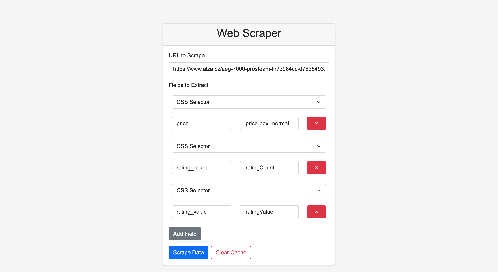
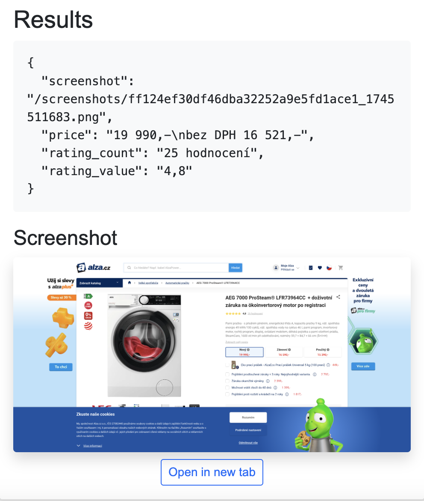

# Scraping Data Testing Application

This is a Ruby on Rails application designed for testing web scraping functionality. The application is containerized using Docker for easy deployment and development.

## System Requirements

* Ruby 3.2.2
* PostgreSQL
* Redis
* Node.js (for asset compilation)

## Technology Stack

* Ruby on Rails 7.1.5
* PostgreSQL Database
* Redis for caching
* Puma Web Server
* Hotwire (Turbo & Stimulus)
* Import Maps for JavaScript
* Sprockets for Asset Pipeline
* Web Scraping Tools:
  * Faraday for HTTP requests
  * Nokogiri for HTML parsing
  * Selenium WebDriver for dynamic content
  * Capybara for testing

## Getting Started

### Local Development Setup

1. Clone the repository:
   ```bash
   git clone https://github.com/chileap/scrapper-web.git
   cd scrapper-web
   ```

2. Install Ruby dependencies:
   ```bash
   bundle install
   ```

3. Install JavaScript dependencies:
   ```bash
   bin/importmap pin
   ```

4. Environment setup (optional):
   ```bash
   cp .env.example .env
   # Edit .env with your configuration
   ```

5. Database setup:
   ```bash
   rails db:create
   rails db:migrate
   ```

6. Start required services:
   ```bash
   # Start Redis
   redis-server

   # Start PostgreSQL
   # (Instructions vary by OS)
   ```

7. Start the Rails server:
   ```bash
   rails server
   ```

## Development

* The application uses standard Rails conventions
* JavaScript is handled through Import Maps
* Hotwire (Turbo and Stimulus) is available for enhanced interactivity
* Web scraping functionality is implemented using Faraday and Nokogiri
* Selenium WebDriver is available for dynamic content scraping

## Testing

The application uses RSpec for testing. Run the test suite with:

```bash
# Run all tests
bundle exec rspec

# Run specific test file
bundle exec rspec spec/path/to/test_file.rb
```

Test helpers available:
* FactoryBot for test data
* Faker for generating test data
* DatabaseCleaner for test isolation
* Capybara for feature testing

## Caching

The web scraper implements caching using Redis to optimize repeated requests. Here's how it works:

1. **Cache Duration**: Results are cached for 1 hour by default
2. **Cache Keys**: Cache keys are generated based on:
   - URL
   - Requested fields
   - Request headers
   - Request parameters
3. **Cache Management**:
   - Results are automatically cached after successful scraping
   - Cache can be cleared for specific URLs or entirely
   - Cache is automatically used for subsequent requests to the same URL with the same fields
   - Cache can be bypassed using the `skip_cache` parameter

### Cache Configuration

The caching system uses Redis for storage. Configuration options:

```ruby
# config/environments/development.rb
config.cache_store = :redis_cache_store, {
  url: ENV['REDIS_URL'],
  namespace: 'scraper_cache',
  expires_in: 1.hour
}
```

## Web Interface

The application provides a user-friendly web interface for scraping data:




### Interface Features

1. **URL Input**: Enter the target URL you want to scrape
2. **Field Configuration**:
   - Add multiple fields to extract
   - Each field requires:
     - Field name (e.g., "price", "rating_count")
     - CSS selector (e.g., ".price-box--normal", ".ratingCount")
3. **Actions**:
   - "Add Field" button to include more fields to extract
   - "Scrape Data" button to initiate the scraping process
   - "Clear Cache" button to remove cached results for the URL

### Example Field Configuration
- Price: `.price-box--normal`
- Rating Count: `.ratingCount`
- Rating Value: `.ratingValue`
